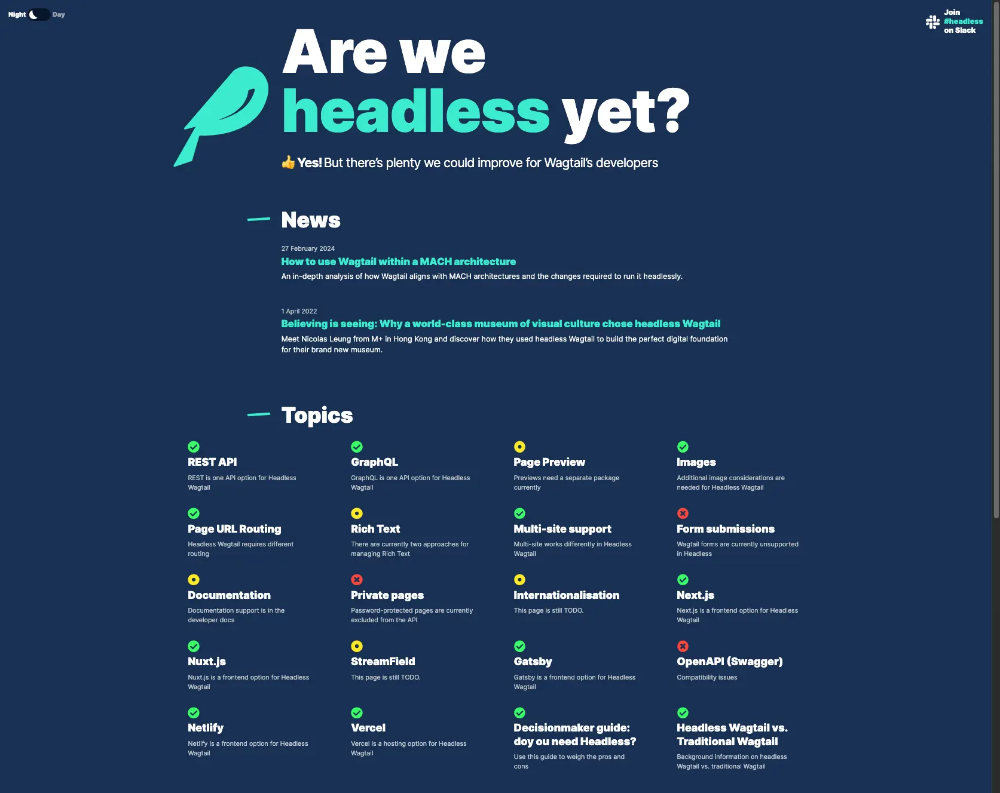

# Are we headless yet? Yes!

This website is now deprecated. Headless support has evolved a lot over the years, and documentation on important features and known gaps is now available in the developer documentation, in the [Headless support](https://docs.wagtail.org/en/latest/advanced_topics/headless.html) page. See also the [wagtail.org Headless](https://wagtail.org/headless/) information page.



This is the source code to Wagtail’s Are we headless yet? website frontend built with [Next.js](https://nextjs.org/).

The backend is available on the [Wagtail's website source code](https://github.com/wagtail/wagtail.org/tree/main/wagtailio/areweheadlessyet).

## Getting Started

First, you need to run the backend where the data is pulled from. See [wagtail.org's README](https://github.com/wagtail/wagtail.org) to setup a local server.

This build assumes the server will be accessible at the following url: `http://0.0.0.0:8000/`. Update the `.env.development` file to customize this behavior.

Next, run the development server:

```bash
npm run dev
# or
yarn dev
```

Open [http://localhost:3000](http://localhost:3000) with your browser to see the result.

## Deployment

The site is hosted on Vercel, and is automatically deployed by pushing to the main branch.

Vercel also provides a preview link whenever a new branch is pushed or modified.

## License

[MIT](https://github.com/wagtail/areweheadlessyet/blob/main/LICENSE)

## Thanks

This website was built by:

- Tidiane Dia ([@Tijani-Dia](https://github.com/Tijani-Dia))
- Thibaud Colas ([@thibaudcolas](https://github.com/thibaudcolas))
- James Hancock ([@jhancock532](https://github.com/jhancock532))
- Sherry ([@shyusu4](https://github.com/shyusu4))

Thank you to Sævar Öfjörð Magnússon and Alex Fulcher who helped move this website’s contents to the [Headless support](https://docs.wagtail.org/en/latest/advanced_topics/headless.html) documentation page as part of [Wagtail Space NL 2024](https://www.fourdigits.nl/blog/wagtail-space-nl-2024-recap-productive-and-fun/). Thank you to everyone who responded to the [2022 Wagtail headless survey](https://github.com/wagtail/wagtail/discussions/12664) to create this website.

[](https://vercel.com/?utm_source=wagtail&utm_campaign=oss)
